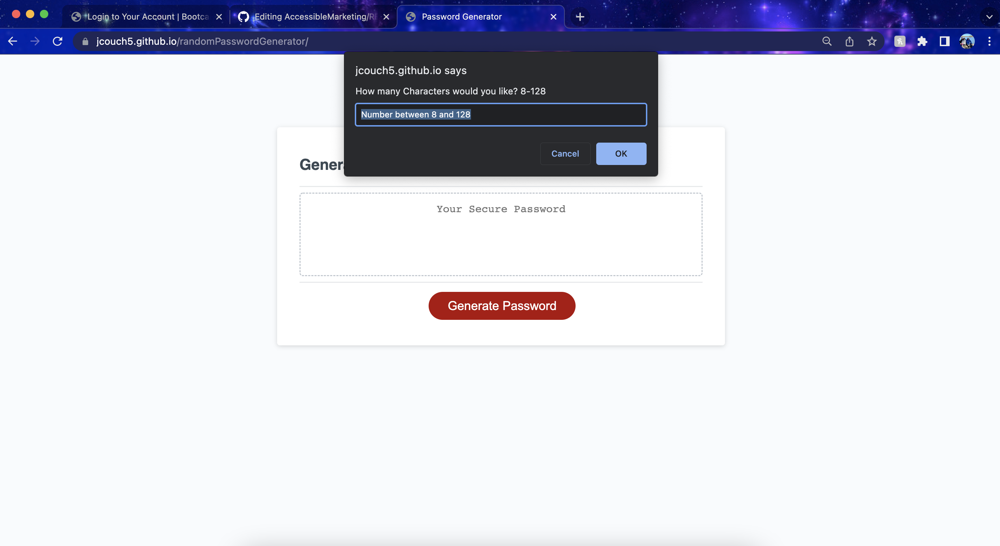

# Random Password Generator
### Homework 3
In this assignment I add functionality to the generate password button that is in the HTML. I added a function to create a random password based on how long the user wants it and what kind of characters they wanted. 

 

# Screenshot

 

# Link to Deployed Application 
### [Deployed Link](https://jcouch5.github.io/randomPasswordGenerator/)